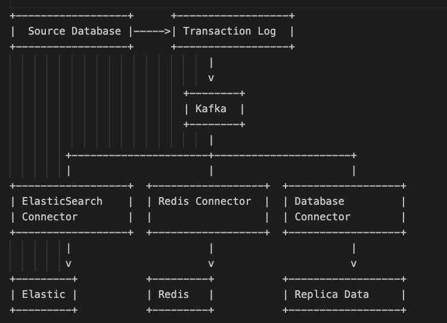

study 디렉토리는 주로 golang과, 자바 스프링을 통해 한 elasticsearch에 대한 공부기록을 담고 있습니다.

studyrecord.md에는 공부 기록들, 증거들?을 정리해두었습니다.

이 리드미에서는 프로젝트에 대한 설명을 먼저한 이후에 생각의 과정들?을 소개하려고 합니다.

먼저 제가 수행한 project에 대해서 설명해보겠습니다.

프로젝트에는 golang으로만 구성된 네 개의 서버가 있습니다.

세개의 서버는 worker 노드로 각각 redis, elasticsearch, replicadb에 대한 연결을 가지고 있습니다.

나머지 한개의 서버는 웹서버로 api엔드포인트를 가지고 있습니다.

POST 형태로 회원가입 요청이 오게 되면 이 웹서버는 이메일 중복확인 후에, uuid와 created_time을 생성, 패스워드를 암호화하여 master db에 저장합니다.

db에 저장이 성공하면, 사용자에게 200 ok response를 주는 것과 별개로 새로운 고루틴(스레드와 비슷한 개념이지만 os런타임이 아닌 go자체런타임)을 통해 동시에 
db에 insert 성공한 객체를 byte로 marshalling(serializing)하여 서버가 시작할 때, 
만들어진 카프카 프로듀서 클라이언트를 통해 메세지를 confluent kafka cloud에 발행합니다. 

이렇게 하게 되면, 하나의 고루틴을 통해 카프카에 메세지를 발행하고 
카프카로부터 메시지가 제대로 발행됬는지 확인(acknowledging)을 받고, 
사용자에게 200 ok response를 주는 것보다 빠르게 사용자에게 응답값을 보여줄 수 있고,

동일하게 하나의 고루틴을 사용하여 사용자에게 200 ok response를 주고 나서 카프카에 메세지를 발행하여 
캐싱과 서칭, replica db에 대한 master db와의 동기화를 하는 것보다 빠르게 메시지를 발행, 
동기화가 빠르게 진행될 수 있다고 생각했습니다.

나머지 세개의 서버는 서버가 시작되면, 동일하게 카프카 컨슈머 클라이언트를 통해 발행될 토픽에 대해 
별개의 고루틴에서 무한 루프를 돌며 리슨을 하고 있습니다.
메시지가 감지되면, 메시지의 토픽을 확인하여 토픽에 맞게 메시지를 객체로
unmarshalling(deserializing)하여 각자 연결되어있는 replicadb, redis, elastic search(cloud)에
저장하도록 했습니다.

redis의 경우, 전체객체를 다시 byte로 marshalling해서 string으로 캐스팅을 해서 저장을 하기 보다는,
redis 자료구조중 하나인 hset을 이용하여 필드별로 저장을 하여, 
나중에 캐싱된 값을 수정하거나, get할 때, 원하는 필드값만 읽어오는 것이 용이하도록 했습니다. 

kafka의 경우 도커 데스크탑환경에서 구동시에 콘테이너가 여러번 꺼지는 문제가 있었고,
엘라스틱 서치와 키바나의 경우 너무 무거워서 다른 콘테이너들과 함께 구동이 힘들었던 관계로 
무료체험으로 제공되는 confluent, elasticsearch 클라우드 환경을 학습하여 사용해보는 것으로 문제를 해결했습니다

db의 경우 postgres를 sql/database 표준 데이터베이스 라이브러리에 드라이버를 통해서 사용했고,
kafka 클라이언트의 경우 shopify에서 만들어져서, 지금은 IBM에서 관리가 되고 있는 sarama를 학습하여 사용했고,
redis 클라이언트의 경우 go-redis보다 벤치마크 성능이 빠른 reuidis를 학습하여 사용했습니다.
elastic search 클라이언트의 경우 go-elasticsearch를 사용했고 typedClient(Spring data JPA와 같이 쿼리작성을 도와줌)를 학습하여 사용했습니다

시연영상입니다.

[시연영상링크](https://drive.google.com/file/d/1SZp5H3qYYYkIBCOo29JdC_gYINRWOMfV/view?usp=sharing)

주요하게 사용된 외부 라이브러리 리스트

https://github.com/IBM/sarama

https://github.com/redis/rueidis

https://github.com/elastic/go-elasticsearch

https://github.com/uber-go/fx

https://github.com/gin-gonic/gin

---

여기서 부터는 소감문과 프로젝트 설명과 별개로 제가 프리코스 챌린지를 수행하면서 한 생각의 과정들을 공유하겠습니다.

이때동안 뭘 배워 봤고 기억에 남아있는게 뭔지
자바, c(전과 전 컴공 재학시절), c++(5년 전에 알고리즘때문에), 파이썬, 스프링, stomp, 
websocket, postman, react, tanstack-query, next.js(파일 라우팅용), postgresql, 
mysql, redis, kafka, msa architecture with spring cloud, k8s, aws eks, rdb, ec2, s3

어느정도 컴포트 존에 속하는 기술은 무엇인지
자바, 스프링(시큐리티, jpa), stomp, react, postgresql, mysql, postman, aws s3

왜 golang을 선택했는지:

1줄요약하자면 컴포트존을 벗어나 견문을 넓혀보자.

평소에 오픈소스, 기술블로그, 채용공고를 보다 보면 자주 보이는 언어 중 하나이고, golang의 경우는 jvm stack이 아니다 보니,

자꾸 그냥 자주 보이네 하고 넘어가기만 하다가는, 또 다른 후보였던 kotlin, elastic search와 달리, 

취직이 되버리면 영영 미지의 영역으로 평생 남아 있지 않을까…라는 생각에, 

이번 프리코스 챌린지를 통해 배워보고 사용해보고자 선택하게 되었습니다.

초기 구상

사용자랑 통신하는 웹서버—————grpc—————뭔가를 처리하는 서버

계획표

1주 동안 전혀 모르는 go에 대해서 알기 위해 스터디 진행

1주 동안 배운 내용을 정리하기 위한 프로젝트

였는데… +1주가 사실상 기정사실화 되면서 엘라스틱서치까지 배워서 프로젝트에 도입해보고 싶어져서 

엘라스틱 서치까지 학습을 진행했습니다.

유튜브로 자료 검색중에 이러한 영상을 보게 됬는데
[Top Kafka Use Cases You Should Know](https://www.youtube.com/watch?v=Ajz6dBp_EB4)

영상에서 이러한 하이레벨 아키텍쳐를 보게되었습니다. 

안그래도 개인 프로젝트에 검색기능을 구현하려고 엘라스틱 서치를 공부해서 도입하려고 했었고,
레디스 캐싱을 @Cacheput 어노테이션을 통해서만은 구현을 하기가 어려워 보였는데,
golang을 통해서 이러한 처리를 해주는 시스템을 구축해서 캐싱과 엘라스틱 서치 최신화를 해줘보자라고 생각이 되었습니다.

엘라스틱 서치에서 포크되어 개발된 오픈 서치의 경우 https://www.uber.com/en-GB/blog/evolution-of-ubers-search-platform/
이번에 함께 공부하게 된 grpc를 지원한다고 들어서 클라이언트 서버단에 사용을 해서 구현을 해보면 좋겠다고 초기에 생각했습니다.

현재 개인 프로젝트에서 xxxRepository.save(xxx)를 호출해서 db를 변경하는 부분을 모두 체크해서, 
카프카에 메시지를 producing하도록 하고, 카프카를 구독하고 있는 서버들이
엘라스틱 서치와 레디스, replicadb를 업데이트 해주도록 프로젝트를 초기에 구상해보았습니다.

여기서부터는 파편적이지만 배우게 된 점, 기술적인 결정들을 모아보았습니다.

go lang orm을 여러개를 둘러봤는데 다 여러가지 이유들로 시원치가 않아서 
제공되는 sql/database 기본 라이브러리를 사용해 raw query를 작성하기로 했고,
스키마 생성만 spring data jpa를 통해서 하면 되겠다고 생각했습니다.
작성하는 과정에서 에디터상에서 soft한 문법 체크가 되도록 작성하는 방식을 터득했습니다.

기본적인 producer측 구성을 위해 자바에 db에 save하는 부분과 연관된 
controller service repository를 고랭으로 포팅 작업을 하면서 언어를 바꿔서 포팅하는 것이 개인적인 숙련도에
큰 도움이 된다고 느꼈습니다, 이 과정에서 고랭은 circular import를 컴파일러측에서 허용하지 않고,
그로 인해 layer 분리를 단일책임원칙에 기반하여 더 잘하지 않으면 컴파일조차 되지 않는 것을 경험했습니다.

기본적인 프로듀서 측을 구성하면서 사용자 요청처리와 카프카 메시지발행을 동시에 하기위해 고루틴을 적용시켰는데,
생각해냈던 아이디어와 동일하게 작동되어서 golang이 왜 동시성처리에 강점이 있는지 몸소 체험할 수 있었습니다.

mysql 사용시 uuid insert를 어떻게 해야할지 방법을 찾지 못했습니다. mysql의 경우 uuid를 바이트 형태로 변형해서
가지고 있는 것으로 알고있는데, 이를 서버측에서 어떤 방식으로 처리를 해서, 보내줘야 할지가 애매모호했고, 시도해본 방식들이
먹히지 않았고, golang에서 sql driver가 mysql 회사측에서 관리되는 것(conneter j)이 아니고, psql도 jdbc 드라이버를
제공하지만 golang의 경우는 그렇지 못하다는 것을 알게 되었습니다. 그래서 raw query로 사용을 해도 사용방식에 차이가 약간씩 있다는 것을 알게되었습니다.
 
직면하게 된 문제의 경우 uuid 타입을 가지는 postgres로 db를 선택하여 문제를 해결했습니다. 
지금 생각해보면 mysql에 사용해야만 하는 상황이온다면 이에 대한 문제를 어떻게 해결해야 할지
해결방안을 찾지 못했던 것 같고, 프리코스가 끝난 후에 더 찾아봐야 할 것 같습니다.

카프카 사용시 멱등성을 지원하도록 프로듀서를 설정하는 것을 고려했고 어떻게 프로듀서에 config을
설정해야 하는지 공부했는데 결국은 설정하지 않았고,주석으로만 남겨두었습니다.
shopify와 같은 회사에서도 sarama client의 멱등성 설정을 병목현상때문에 하지
않는다는 것을 깃헙이슈에서 확인했고, 멱등성 자체는 컨슈머측에서 소비를 하는 과정에서 중복을
방지하는 서비스 로직차원에서 지원해도 된다고 생각을 했습니다.

프로젝트 중에 slave db(replica db)를 생성하는 것이 일부분이여서, 이에 대해서 공부하다가
cassandra에 대해서 다시 관심을 가지게 되었고 mysql이나 psql과 달리 go용 클라이언트가 
아파치 재단 깃헙에서 유지 관리가 계속해서 되고 있는 것을 확인했고 사용해보고 싶었으나 공부량이 꽤되서
 프로젝트가 끝나고 따로 학습하여 사용해보기로 했습니다.
  에이블리와 같은 회사에서 scylladb를 사용하는 것으로 알고 있고,
scylladb가 cassandra를 기반으로 구축되었다고 들어서 공부를 해두면 나중에 쓸모가 있을 것 같다고 생각했습니다.

golang, grpc, Elasticsearch를 배우려고,
유료강의를 네개 정도 사서 인프런에서 들었는데, 원래 목적이던 golang이나 grpc, elasticsearch말고도 
추가적으로 배우게 된 것 중에 배워보고 싶었는데 java, spring에 관련 자료를 찾지 못해서
 배우지 못했던 것과 나중에 프로젝트에 적용시키면 재밌고 좋을 것 같다고 여겨지는 것도 배울 수 있었습니다.

mysql의 geospatial sql -> jpa를 통해서도 쉽게 사용가능

qr로 google authenticator에 등록해서 totp로 인증 -> 실제로 사용되는 서비스라 신기했고, 따라서 해봤는데 핸드폰
authenticator앱에서도 잘 작동

cloudfront를 통한 edge location cdn 캐싱 -> 자바 스프링과 별로 관련이 없는데, 배워보고 싶었지만 자료를 찾지 못했는데 이번기회에 우연히 배우게 됨

aws lamda를 통해서 사진 압축 -> aws lamda의 경우 파이썬이나 nodejs가 성능이 go나 자바보다 빠르다는 것도 알게됨

redis golang 클라이언트 라이브러리의 경우 go-redis가 있었고 reuidis라는 것이 있었는데
reuidis가 valkey client와 동일한 형태인 것을 확인했고,(아마 포크를 한 것으로 보임) 
더 빠르다고 설명이 되어 있어서, 사용을 하려 했는데 주석이 sarama 카프카 클라이언트와 달리 거의 없는 수준이었고, 
공식 깃헙에서도 레디스에 대해 잘 안다는 전제하에 설명을 해주고 있어서 
클라이언트를 사용하면서 유튜브에 올라와있는 강의도 듣고, 주석을 읽고 검색을 해보면서 공부를 해나갔던 sarama와 달리
 어떻게 사용을 해야 할지가 막막했던 상황에, 코파일럿에게 해당 클라이언트로 
 제가 사용할 엔티티를 저장하는 방법에 대한 예제를 적어달라고 했고 이를 보고 참고해서 
 코드를 작성해서, 라이브러리에 대해 이해도 하고, 제가 해결하려는 문제, 캐싱 또한 해결해나갈 수 있었습니다.
그 과정에서 코파일럿이 적어준 코드에 메소드 체이닝을 잘못사용한 오류가 있어서 수정을 해서 사용을 했습니다.

config에 있는 elastic search cloud, confluent cloud kafka cluster 
api key와 secret key가 깃헙에 올라가서 이를 지우려고 했는데, 새로 git init을 해서 커밋이력을 
전부 지우지 않는이상, 커밋 이력을 통해서 볼 수 있다는 사실을 알고, 
해당 api key와 secret을 클라우드에서 revoke했습니다. 
다음부터는 gitignore를 프로젝트를 git init하는 시점부터 잘 적어두어서, 
이런일이 발생하지 않도록 해야겠다고 생각했습니다.

데이터베이스 로그를 데이터베이스로 부터 읽을 수 있는 방식을 취하지 않고 
고루틴을 적용시켜보고 싶어서, 웹서버에서 새로운 고루틴을 통해 카프카에 메시지를 보내는 방식을 취했는데,
데이터베이스에서 로그를 읽는 방법 또한 공부를 프리코스이후에 해보아야 겠다고 생각했습니다.

시간관계상 오픈서치 grpc 클라이언트를 이용하지 못하고, 엘라스틱서치를 선택했는데, 우버에서 개발한 
오픈서치 grpc 클라이언트를 다음에는 grpc를 어떻게 하는 것인지 이번 프리코스를 통해서 공부하게 되었으니까
다음엔 사용해보자고 생각했습니다.

redis와 kafka golang 클라이언트의 경우 golang에 대한 지식뿐만아니라, kafka, redis에 대한 지식이 상당수준 요구되어서,
이번 기회에 대충만 알고 있었던 지식을 뚜렷하고 확실하게 알 수 있었습니다.

예를 들어 카프카 sarama 클라이언트를 유튜브에서 누가 영어로 강의를 올려놓은 것을 듣다가 consumer를 consumergroup이 아닌
partition counsumer를 통해서 0번 파티션것만 consume하는 것을 확인해서 예시를 보여주는 것을 보았는데,
과거에 자바 스프링을 통해서 @KafkaListener를 통해서 소비를 할때 topic을 기준으로 모든 consumer group을 통해서
소비를 해야 된다는 것을  공부를 해두었어서, 직접 consumer group을 sarama library에서 있는 것을 확인하고 예제를 
두세개 정도 찾아서 학습해서 프로젝트에 적용시켜서 파티션과 관계없이 토픽에 대해 동기화 서버가 consume할 수 있도록 설정을 했습니다.

레디스의 경우 pub sub과 caching기능이 아예 별개의 기능이라는 것을 정확하게 이해하게 되었고, redis또한 pub sub과 별개로
kafka와 비슷한 stream이라는 것이 자료구조로 존재해서, 운용비용이 비싸고, 튜닝을 요구하는 카프카 사용을 감당할 수 없다면, 
사용해보기에 좋겠다고 생각했습니다. 또 reuidis 클라이언트 라이브러리 리드미를 읽어보다가 클라이언트 캐싱이라는,
레디스 클라이언트 서버 측에서 레디스 캐싱과 별개로 캐싱을 해서 더 빠른 응답속도를 낼 수 있는 것이 존재한다는 것을 알게 되었고,
또 golang이나 다른 언어로 레디스와 함께 여러서버를 돌리는 프로젝트를 하면, 사용해보자고 생각했습니다.

golang을 학습하고 프로젝트하면서 고루틴, 사실상의 멀티스레딩을 많이 사용해볼 수 있었는데, 이는
평소에 자바 스프링으로 학습과 프로젝트를 해오고, 로직을 작성하면서 전혀 해볼 일이 없었던 일들이라,
스프링으로 추상화되어 있는 부분들이 어떤 방식으로 멀티스레딩을 이용해서 구현이 되어있을지도 생각해볼 수 있었습니다.

예를 들어 uber fx라는 dependency injection 프레임워크를 학습하여 사용했는데, 이 프레임워크는 DI와 별개로
서버가 꺼지지 않게끔 하는 기능을 추가적으로 제공해주고 있었는데, spring도 이처럼 blocking을 통해서 구현이 되어 있는 것을
기억할 수 있었고, 또, 카프카의 컨슈머를 구성할 때, 새로운 고루틴의 무한 루프를 통해서 계속해서 카프카를 listen하는 구조를 보면서,
@KafkaListener, @Controller 스프링 어노테이션이 내부적으로 이와 같이 동작을 하고 있음을 추측해볼 수 있었습니다.

애플리케이션을 설계할 때, 카프카 프로듀서의 경우 서비스에서 호출하여 메시지를 프로듀스했지만,
 컨슈머의 경우 circular import를 피하려면 프로듀서가 있는 웹서버의 구조와 반대로
 카프카 컨슈머가 컨트롤러 레이어처럼 서비스를 호출하도록 만들었어야 되어서 중간에 계층구조를 수정했습니다.

처음에 컨슈머를 구성할 때는, 카프카 컨슈머측에서 메시지가 들어오면 토픽을 확인해서 그 토픽에 맞는
서비스를 호출하도록 만들었는데, 이게 이상하다고 생각이 되어서 서비스 로직으로 토픽 분기처리를 해주는 로직을
옮겼고, 향후에 프로젝트를 더 만들어 나갈 때도 토픽, db테이블이 추가되어도 확장하기가 간단하게 설계를 했습니다.
이러한 과정에서 계층분리, 단일책임원칙에 대해서 고민을 많이 했던 것 같습니다.

서칭의 경우 기능자체는 프로젝트에 포함시킬 수 없었어서, 다음에는 이번 프리코스를 통해 공부하게 된
서칭 필터를 적용시킨 인덱스도 생성해보고,프론트엔드와 연동해서 쿼리도 실시간으로 날려보는 프로젝트를
해보고 싶다고 생각했습니다.

